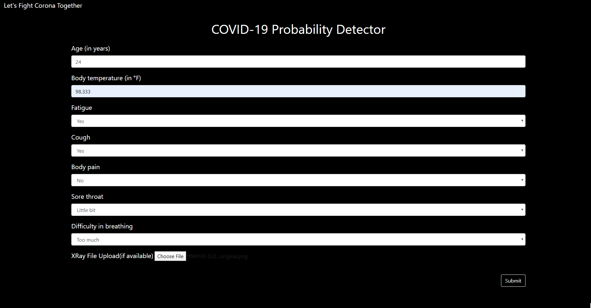
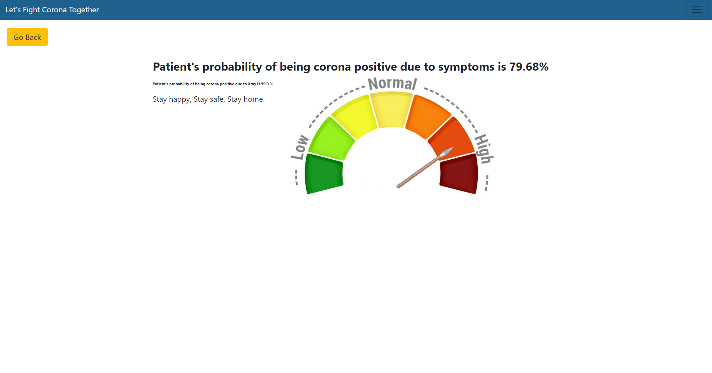

# COVID-VOICE - Project for the pioneer hackathon

COVID-19 is an infectious disease caused by severe acute respiratory syndrome coronavirus 2 (SARS-CoV-2), previously known as the 2019 novel coronavirus (2019-nCoV), a strain of coronavirus. The first cases were seen in Wuhan, China, in December 2019 before spreading globally. The current outbreak was officially recognized as a pandemic on 11 March 2020 44. The non-specific imaging findings are most commonly of atypical or organizing pneumonia, often with a bilateral, peripheral, and basal predominant distribution 32. No effective treatment or vaccine exists currently (April 2020)  

The struggles among the doctors and other health care specialists on detecting COVID-19 increases when there is a limitation of kits to detect the patients affected by Coronavirus. To avoid or to overcome such a situation, the detection of COVID-19 can be processed via different means, which may require minimal contact. 

1. **Getting the following basic informations from a person**
    - Age of the person
    - Body temperature 
    - Is she/he feeling fatigue? (Yes/No)
    - Is she/he having cough? (Yes/No)
    - Is she/he experiencing bodypain? (Yes/No)
    - Is she/he have sorethroat? (No/ Little bit/ Yes)
    - Is she/he have breathing difficulty? (No/ Little bit/ Yes)
  
2. **From Chest XRay Image**
    - The imaging appearance of COVID-19 is not specific, the presence of bilateral nodular and peripheral ground-glass opacities and consolidation should serve as an alert to radiologists that COVID-19 may actually be present in certain patients.
## Model building 
Using the availbale dataset models has been trained using Machine Learning algorithm (CatboostClassifier and Deep Convolutional Neural Network)for both the approach and tested with amble amount of available data.

The obtained [f1-score](https://towardsdatascience.com/accuracy-precision-recall-or-f1-331fb37c5cb9) for the first approach and second approach is 0.84 and 0.83

## Web app

A web app has been created to get the inputs from users, this will be helpful for all the doctors to get the result in fraction of second.

**We are also building voice based dialogflow skill to get the information from a person**

### Future Scope
This project can be extended by including more vital measurements through images such as heart rate, BMI, temperature and more factors for probability prediction such as travel history and pre-existing conditions. Both the models used for x-ray and probability prediction need to be fine-tuned. We also can introduce new datasets along with database integration and edge case handling. 
